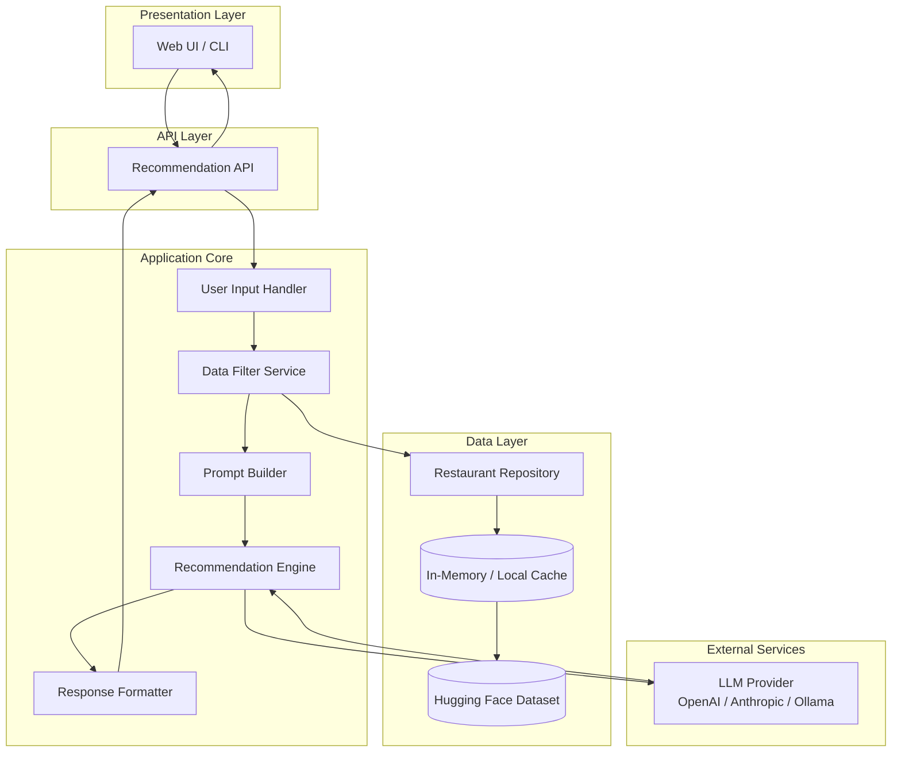
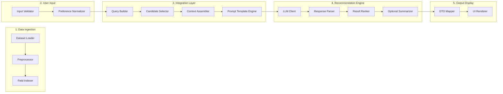
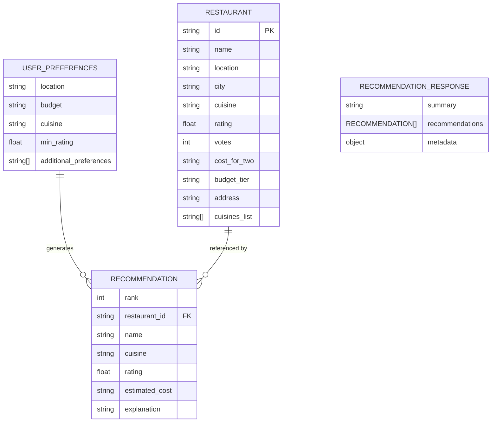
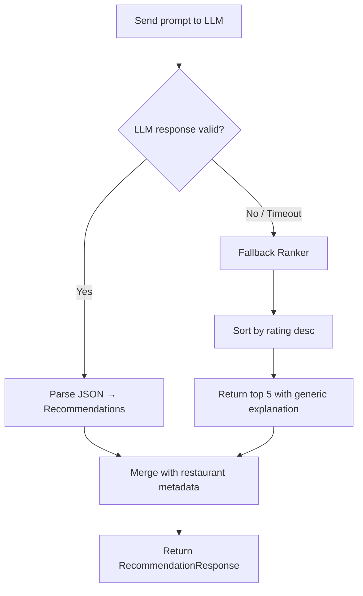
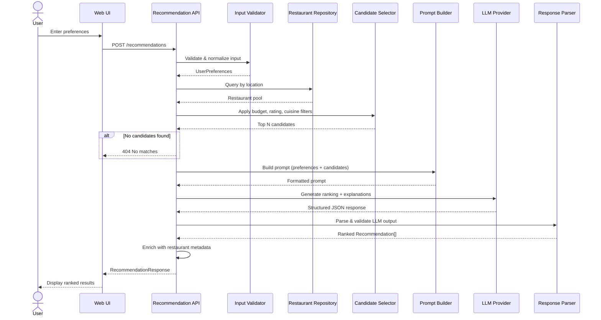
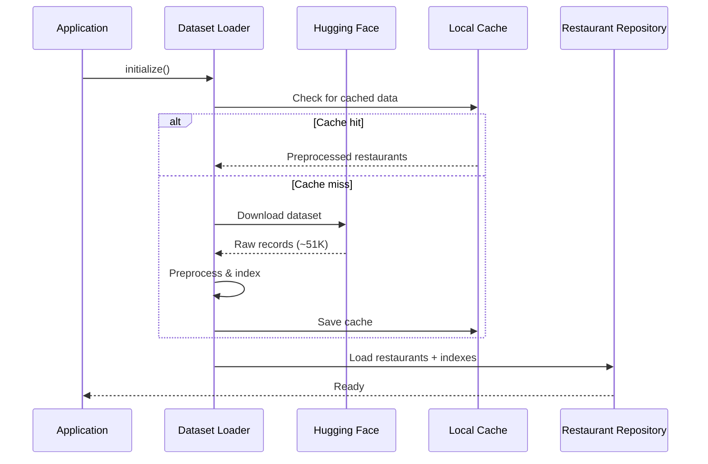
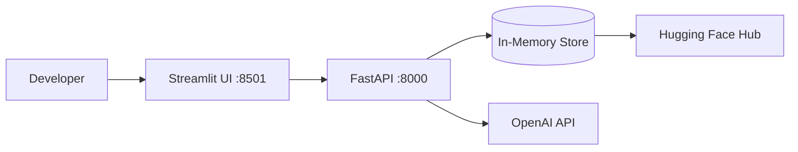
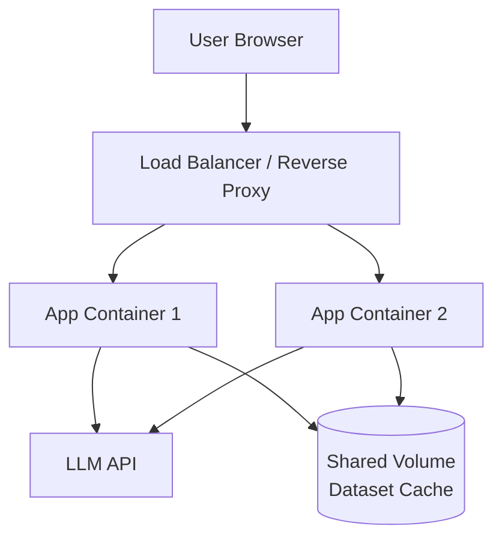

# Architecture: AI-Powered Restaurant Recommendation System

This document describes the system architecture for the Zomato-inspired restaurant recommendation service defined in [problemStatement.md](./problemStatement.md). The design combines structured data filtering with LLM-based reasoning to deliver personalized, explainable recommendations.

---

## Table of Contents

1. [Architecture Overview](#1-architecture-overview)
2. [Design Principles](#2-design-principles)
3. [Component Architecture](#3-component-architecture)
4. [Data Architecture](#4-data-architecture)
5. [Application Layers](#5-application-layers)
6. [LLM Integration](#6-llm-integration)
7. [API Design](#7-api-design)
8. [Request Flow](#8-request-flow)
9. [Technology Stack](#9-technology-stack)
10. [Project Structure](#10-project-structure)
11. [Deployment Architecture](#11-deployment-architecture)
12. [Non-Functional Requirements](#12-non-functional-requirements)
13. [Future Extensions](#13-future-extensions)

---

## 1. Architecture Overview

The system follows a **layered pipeline architecture**: ingest static restaurant data once, accept user preferences at runtime, filter candidates deterministically, then delegate ranking and explanation generation to an LLM.



### High-Level Summary

| Layer | Responsibility |
|-------|----------------|
| **Presentation** | Collect preferences; render ranked recommendations with explanations |
| **API** | Validate input, orchestrate the pipeline, return structured JSON |
| **Application Core** | Filter data, build prompts, invoke LLM, parse and format output |
| **Data** | Load, preprocess, and serve restaurant records from Hugging Face |
| **External** | LLM API for ranking, explanation, and optional summary |

---

## 2. Design Principles

| Principle | Rationale |
|-----------|-----------|
| **Separation of concerns** | Deterministic filtering (location, budget, rating) stays in code; subjective ranking stays with the LLM |
| **Grounded recommendations** | LLM receives only pre-filtered, structured restaurant records — no hallucinated venues |
| **Explainability by design** | Every recommendation includes an AI-generated reason tied to user preferences |
| **Fail gracefully** | If the LLM is unavailable, return rule-based ranked results without explanations |
| **Single source of truth** | Hugging Face dataset is the authoritative restaurant catalog |
| **Stateless API** | Each recommendation request is independent; no session persistence required for MVP |

---

## 3. Component Architecture



### 3.1 Data Ingestion Module

**Purpose:** Load and prepare the Zomato dataset at application startup (or on first request).

| Component | Description |
|-----------|-------------|
| `DatasetLoader` | Fetches `ManikaSaini/zomato-restaurant-recommendation` via Hugging Face `datasets` library (~51K records) |
| `Preprocessor` | Cleans nulls, normalizes cuisine strings, maps cost to budget tiers, standardizes location names |
| `FieldExtractor` | Retains: `name`, `location`, `cuisine`, `cost`, `rating`, and any available metadata (votes, address, etc.) |
| `RestaurantRepository` | In-memory store with indexed lookups by location and cuisine |

**Startup sequence:**

1. Download/load dataset from Hugging Face
2. Transform raw rows into normalized `Restaurant` entities
3. Build indexes for fast filtering (location → restaurants, cuisine → restaurants)
4. Cache processed data locally (optional pickle/Parquet) to avoid re-download on restart

### 3.2 User Input Module

**Purpose:** Accept, validate, and normalize user preferences.

**Input schema:**

```json
{
  "location": "Bangalore",
  "budget": "medium",
  "cuisine": "Italian",
  "min_rating": 4.0,
  "additional_preferences": ["family-friendly", "quick service"]
}
```

| Field | Type | Validation |
|-------|------|------------|
| `location` | string | Required; must match a known city in dataset |
| `budget` | enum | `low` \| `medium` \| `high` |
| `cuisine` | string | Optional; fuzzy-matched against dataset cuisines |
| `min_rating` | float | Optional; range 0.0–5.0 |
| `additional_preferences` | string[] | Optional; free-text tags passed to LLM context |

### 3.3 Integration Layer

**Purpose:** Bridge structured data and the LLM — the critical middleware of the system.

| Component | Responsibility |
|-----------|----------------|
| `QueryBuilder` | Translates normalized preferences into filter criteria |
| `CandidateSelector` | Applies hard filters (location, min rating, budget band, cuisine) |
| `ContextAssembler` | Packages top N candidates (e.g., 15–25) into a compact JSON/text block |
| `PromptTemplateEngine` | Injects user preferences + candidate list into a structured prompt |

**Filtering strategy (deterministic, pre-LLM):**

```
ALL restaurants
  → filter by location
  → filter by min_rating
  → filter by budget tier (cost field mapped to low/medium/high)
  → filter by cuisine (if specified)
  → sort by rating descending
  → take top N candidates (cap to manage token budget)
  → pass to LLM for re-ranking and explanation
```

### 3.4 Recommendation Engine

**Purpose:** Use the LLM to rank, explain, and optionally summarize recommendations.

| Component | Responsibility |
|-----------|----------------|
| `LLMClient` | Abstracts provider (OpenAI, Anthropic, local Ollama); handles retries and timeouts |
| `PromptExecutor` | Sends assembled prompt; receives structured or free-text response |
| `ResponseParser` | Parses LLM output into typed `Recommendation` objects |
| `FallbackRanker` | Rule-based ranking (rating × vote count) when LLM fails |
| `Summarizer` | Generates a brief overview of the recommendation set (optional) |

**LLM output contract (structured JSON preferred):**

```json
{
  "summary": "Based on your preference for Italian cuisine in Bangalore with a medium budget...",
  "recommendations": [
    {
      "restaurant_id": "12345",
      "rank": 1,
      "explanation": "Highly rated Italian spot with moderate pricing, ideal for family dining."
    }
  ]
}
```

### 3.5 Output Display Module

**Purpose:** Present results in a user-friendly format.

**Response DTO:**

```json
{
  "summary": "AI-generated overview of choices",
  "recommendations": [
    {
      "rank": 1,
      "name": "Truffles",
      "cuisine": "Italian, Continental",
      "rating": 4.5,
      "estimated_cost": "₹800 for two",
      "location": "Bangalore",
      "explanation": "Matches your medium budget and family-friendly preference with excellent ratings."
    }
  ],
  "metadata": {
    "total_candidates_considered": 18,
    "filters_applied": ["location=Bangalore", "budget=medium", "cuisine=Italian"]
  }
}
```

---

## 4. Data Architecture

### 4.1 Domain Model



### 4.2 Budget Tier Mapping

Since the dataset uses cost fields (typically "₹XXX for two"), map to tiers at preprocessing time:

| Tier | Cost Range (₹ for two) |
|------|------------------------|
| `low` | ≤ 500 |
| `medium` | 501 – 1500 |
| `high` | > 1500 |

*(Exact thresholds should be calibrated against actual dataset distribution during ingestion.)*

### 4.3 Data Source

| Attribute | Value |
|-----------|-------|
| Source | [ManikaSaini/zomato-restaurant-recommendation](https://huggingface.co/datasets/ManikaSaini/zomato-restaurant-recommendation) |
| Records | ~51,717 restaurants |
| Size | ~574 MB |
| Load strategy | One-time download; cached locally |
| Update frequency | Static for MVP; re-fetch on manual refresh |

---

## 5. Application Layers

```
┌─────────────────────────────────────────────────────────┐
│                  Presentation Layer                      │
│   Streamlit / React UI  ·  CLI  ·  REST Client          │
├─────────────────────────────────────────────────────────┤
│                     API Layer                            │
│   POST /recommendations  ·  GET /health  ·  GET /meta   │
├─────────────────────────────────────────────────────────┤
│                  Service Layer                           │
│   RecommendationService  ·  RestaurantService            │
├─────────────────────────────────────────────────────────┤
│                   Core Layer                             │
│   FilterEngine  ·  PromptBuilder  ·  LLMEngine  ·  Parser│
├─────────────────────────────────────────────────────────┤
│                   Data Layer                             │
│   RestaurantRepository  ·  DatasetLoader  ·  Cache       │
├─────────────────────────────────────────────────────────┤
│                 External Layer                           │
│   Hugging Face Hub  ·  LLM API (OpenAI / Anthropic)     │
└─────────────────────────────────────────────────────────┘
```

---

## 6. LLM Integration

### 6.1 Prompt Architecture

The prompt has three sections to maximize grounding and output quality:

```
┌──────────────────────────────────────┐
│  SYSTEM PROMPT                         │
│  Role, constraints, output format      │
├──────────────────────────────────────┤
│  USER CONTEXT                        │
│  Preferences + additional notes      │
├──────────────────────────────────────┤
│  CANDIDATE DATA                      │
│  Structured list of N restaurants    │
└──────────────────────────────────────┘
```

**System prompt (excerpt):**

> You are a restaurant recommendation assistant. You receive a list of real restaurants and user preferences. Rank the top 5 restaurants that best match the user's needs. For each, provide a concise explanation referencing specific attributes (rating, cost, cuisine). Do not invent restaurants not in the provided list. Respond in valid JSON.

### 6.2 Token Budget Management

| Parameter | Recommended Value |
|-----------|-------------------|
| Max candidates sent to LLM | 15–25 |
| Max recommendations returned | 5 |
| Fields per candidate in prompt | id, name, cuisine, rating, cost, location |
| Response format | JSON (with schema enforcement via function calling or structured output) |

### 6.3 LLM Provider Abstraction

```python
# Conceptual interface
class LLMProvider(Protocol):
    def generate(self, system_prompt: str, user_prompt: str) -> str: ...
    def generate_structured(self, system_prompt: str, user_prompt: str, schema: dict) -> dict: ...
```

Supported providers for MVP:

| Provider | Model Example | Use Case |
|----------|---------------|----------|
| OpenAI | `gpt-4o-mini` | Production; cost-effective |
| Anthropic | `claude-3-5-haiku` | Production alternative |
| Ollama | `llama3` | Local development / offline demo |

### 6.4 Fallback Strategy



---

## 7. API Design

### 7.1 Endpoints

#### `POST /api/v1/recommendations`

Generate personalized restaurant recommendations.

**Request:**

```json
{
  "location": "Delhi",
  "budget": "high",
  "cuisine": "Chinese",
  "min_rating": 4.0,
  "additional_preferences": ["romantic ambiance"],
  "limit": 5
}
```

**Response `200 OK`:**

```json
{
  "summary": "Here are the top Chinese restaurants in Delhi matching your high-budget preference...",
  "recommendations": [
    {
      "rank": 1,
      "name": "Example Restaurant",
      "cuisine": "Chinese, Asian",
      "rating": 4.6,
      "estimated_cost": "₹2500 for two",
      "location": "Delhi",
      "explanation": "Premium Chinese dining with excellent ratings, suited for a romantic evening."
    }
  ],
  "metadata": {
    "total_candidates_considered": 22,
    "filters_applied": ["location=Delhi", "budget=high", "cuisine=Chinese", "min_rating=4.0"],
    "llm_provider": "openai",
    "processing_time_ms": 1840
  }
}
```

**Error responses:**

| Status | Condition |
|--------|-----------|
| `400` | Invalid input (unknown location, bad budget enum) |
| `404` | No restaurants match filters |
| `503` | LLM unavailable and fallback disabled |
| `500` | Internal server error |

#### `GET /api/v1/meta/locations`

Returns list of supported cities from the dataset.

#### `GET /api/v1/meta/cuisines`

Returns list of available cuisines.

#### `GET /health`

Health check including dataset load status.

---

## 8. Request Flow

### 8.1 End-to-End Sequence



### 8.2 Startup Flow



---

## 9. Technology Stack

### Recommended Stack (Python MVP)

| Layer | Technology | Justification |
|-------|------------|---------------|
| Language | Python 3.11+ | Rich ML/data ecosystem; Hugging Face native support |
| Web framework | FastAPI | Async, auto OpenAPI docs, Pydantic validation |
| UI | Streamlit | Rapid prototyping; form inputs + result cards |
| Dataset | `datasets` (Hugging Face) | Direct load of HF dataset |
| Data processing | pandas | Cleaning and transformation |
| LLM | `openai` / `anthropic` SDK | Structured output support |
| Config | pydantic-settings + `.env` | API keys, model selection |
| Testing | pytest | Unit + integration tests |
| Containerization | Docker | Reproducible deployment |

### Alternative Stack (Full-Stack)

| Layer | Technology |
|-------|------------|
| Backend | FastAPI (Python) |
| Frontend | React + TypeScript |
| Styling | Tailwind CSS |
| Deployment | Vercel (frontend) + Railway/Render (backend) |

---

## 10. Project Structure

```
ZomatoRecommendation/
├── docs/
│   ├── problemStatement.md
│   ├── problemStatement.txt
│   └── architecture.md          # this document
├── src/
│   ├── __init__.py
│   ├── main.py                  # FastAPI app entry point
│   ├── config.py                # Settings & env vars
│   ├── models/
│   │   ├── restaurant.py        # Restaurant entity
│   │   ├── preferences.py       # UserPreferences schema
│   │   └── recommendation.py    # Recommendation response DTOs
│   ├── data/
│   │   ├── loader.py            # Hugging Face dataset loader
│   │   ├── preprocessor.py      # Cleaning & normalization
│   │   └── repository.py        # In-memory restaurant store
│   ├── services/
│   │   ├── filter_service.py    # Candidate selection logic
│   │   ├── recommendation_service.py  # Orchestrator
│   │   └── metadata_service.py  # Locations, cuisines lookup
│   ├── llm/
│   │   ├── provider.py          # LLM abstraction
│   │   ├── prompt_builder.py    # Prompt templates
│   │   ├── response_parser.py   # Parse LLM JSON output
│   │   └── fallback.py          # Rule-based fallback ranker
│   └── api/
│       ├── routes/
│       │   ├── recommendations.py
│       │   └── metadata.py
│       └── dependencies.py      # DI for services
├── ui/
│   └── app.py                   # Streamlit frontend
├── tests/
│   ├── unit/
│   │   ├── test_filter_service.py
│   │   ├── test_preprocessor.py
│   │   └── test_prompt_builder.py
│   └── integration/
│       └── test_recommendation_flow.py
├── data/
│   └── .gitkeep                 # Local cache directory (gitignored)
├── .env.example
├── .gitignore
├── requirements.txt
├── Dockerfile
└── README.md
```

---

## 11. Deployment Architecture

### 11.1 Local Development



### 11.2 Production (Containerized)



| Concern | Approach |
|---------|----------|
| **Scaling** | Horizontal — stateless API; dataset loaded per instance at startup |
| **Caching** | Preprocessed dataset cached on persistent volume |
| **Secrets** | LLM API keys via environment variables / secret manager |
| **Monitoring** | Log request latency, LLM token usage, filter match rates |
| **Cost control** | Cap candidates sent to LLM; use smaller models for MVP |

---

## 12. Non-Functional Requirements

| Requirement | Target |
|-------------|--------|
| **Latency** | < 5s end-to-end (including LLM call) |
| **Availability** | 99% uptime; graceful LLM fallback |
| **Accuracy** | Recommendations must come from filtered dataset only |
| **Security** | API keys in env vars; input sanitization on all user fields |
| **Observability** | Structured logging; track LLM token usage per request |
| **Testability** | Mock LLM provider for unit/integration tests |
| **Portability** | Dockerized; runs locally with Ollama for offline demos |

---

## 13. Future Extensions

| Extension | Description |
|-----------|-------------|
| **User profiles** | Persist preferences and order history for repeat visitors |
| **Vector search** | Embed restaurant descriptions; semantic cuisine/preference matching |
| **Multi-turn chat** | Conversational refinement ("show me something cheaper") |
| **Geolocation** | Filter by neighborhood or distance, not just city |
| **Real-time data** | Integrate live Zomato API for hours, availability, offers |
| **A/B testing** | Compare LLM models and prompt variants on user satisfaction |
| **Feedback loop** | Collect thumbs up/down to fine-tune ranking prompts |
| **Caching layer** | Redis cache for popular location+cuisine query combinations |

---

## Appendix: Mapping to Problem Statement

| Problem Statement Section | Architecture Component |
|---------------------------|------------------------|
| Data Ingestion | `DatasetLoader`, `Preprocessor`, `RestaurantRepository` |
| User Input | `Input Validator`, `UserPreferences` model, Streamlit/API form |
| Integration Layer | `FilterService`, `PromptBuilder`, `ContextAssembler` |
| Recommendation Engine | `LLMClient`, `ResponseParser`, `FallbackRanker` |
| Output Display | `RecommendationResponse` DTO, Streamlit UI cards |
