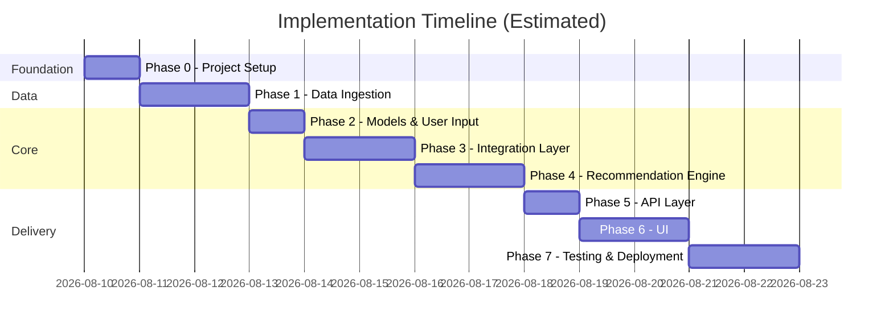
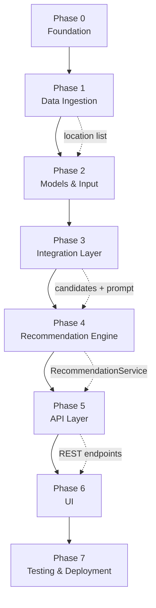

# Phase-Wise Implementation Plan

This document provides a step-by-step implementation plan for the AI-Powered Restaurant Recommendation System, derived from [problemStatement.md](./problemStatement.md) and [architecture.md](./architecture.md).

---

## Table of Contents

1. [Plan Overview](#1-plan-overview)
2. [Phase Summary](#2-phase-summary)
3. [Phase 0: Project Foundation](#phase-0-project-foundation)
4. [Phase 1: Data Ingestion](#phase-1-data-ingestion)
5. [Phase 2: Domain Models & User Input](#phase-2-domain-models--user-input)
6. [Phase 3: Integration Layer](#phase-3-integration-layer)
7. [Phase 4: Recommendation Engine](#phase-4-recommendation-engine)
8. [Phase 5: API Layer](#phase-5-api-layer)
9. [Phase 6: Output Display (UI)](#phase-6-output-display-ui)
10. [Phase 7: Testing, Hardening & Deployment](#phase-7-testing-hardening--deployment)
11. [Dependency Graph](#dependency-graph)
12. [MVP Success Criteria](#mvp-success-criteria)
13. [Risks & Mitigations](#risks--mitigations)

---

## 1. Plan Overview

The implementation follows the five-stage workflow defined in the problem statement, expanded into seven executable phases. Each phase produces a testable increment and maps directly to architecture components.



**Total estimated effort:** 13 working days (solo developer)

---

## 2. Phase Summary

| Phase | Name | Problem Statement Mapping | Architecture Components | Est. Duration |
|-------|------|---------------------------|-------------------------|---------------|
| 0 | Project Foundation | — | Config, project scaffold | 1 day |
| 1 | Data Ingestion | §1 Data Ingestion | `DatasetLoader`, `Preprocessor`, `RestaurantRepository` | 2 days |
| 2 | Domain Models & User Input | §2 User Input | `UserPreferences`, validators, Pydantic schemas | 1 day |
| 3 | Integration Layer | §3 Integration Layer | `FilterService`, `PromptBuilder`, `ContextAssembler` | 2 days |
| 4 | Recommendation Engine | §4 Recommendation Engine | `LLMClient`, `ResponseParser`, `FallbackRanker` | 2 days |
| 5 | API Layer | — | FastAPI routes, orchestration, error handling | 1 day |
| 6 | Output Display | §5 Output Display | Next.js UI, API client, design system | 2 days |
| 7 | Testing & Deployment | — | Tests, Docker, README, observability | 2 days |

---

## Phase 0: Project Foundation

**Goal:** Establish the project scaffold, dependencies, and configuration so all subsequent phases have a consistent base.

### Tasks

| # | Task | Output |
|---|------|--------|
| 0.1 | Initialize Python project with virtual environment | `venv/`, Python 3.11+ |
| 0.2 | Create `requirements.txt` with core backend dependencies | `fastapi`, `uvicorn`, `datasets`, `pandas`, `pydantic-settings`, `openai`, `pytest`, `httpx` |
| 0.3 | Scaffold directory structure per architecture §10 | `src/`, `ui/`, `tests/`, `data/` |
| 0.4 | Add `.env.example` with `OPENAI_API_KEY`, `LLM_PROVIDER`, `LLM_MODEL` | Config template |
| 0.5 | Implement `src/config.py` using pydantic-settings | Centralized settings |
| 0.6 | Add `.gitignore` (venv, `.env`, `data/cache/`, `__pycache__`) | Git hygiene |
| 0.7 | Create minimal `README.md` with setup instructions | Developer onboarding |

### Files to Create

```
ZomatoRecommendation/
├── src/
│   ├── __init__.py
│   └── config.py
├── data/.gitkeep
├── .env.example
├── .gitignore
├── requirements.txt
└── README.md
```

### Acceptance Criteria

- [ ] `pip install -r requirements.txt` succeeds without errors
- [ ] `src/config.py` loads settings from environment variables
- [ ] Project structure matches architecture §10
- [ ] `.env.example` documents all required config keys

### Dependencies

None — this is the starting phase.

---

## Phase 1: Data Ingestion

**Goal:** Load, preprocess, and cache the Zomato dataset from Hugging Face; expose an in-memory repository for fast lookups.

**Maps to:** Problem Statement §1 — *Load and preprocess the Zomato dataset; extract relevant fields*

### Tasks

| # | Task | Output |
|---|------|--------|
| 1.1 | Define `Restaurant` Pydantic model | `src/models/restaurant.py` |
| 1.2 | Implement `DatasetLoader` — fetch from Hugging Face | `src/data/loader.py` |
| 1.3 | Inspect raw dataset schema; document field mappings | Inline comments / docstring |
| 1.4 | Implement `Preprocessor` — clean nulls, normalize cuisines, parse cost | `src/data/preprocessor.py` |
| 1.5 | Map cost to budget tiers (low ≤ ₹500, medium ₹501–1500, high > ₹1500) | Budget tier logic in preprocessor |
| 1.6 | Standardize location/city names (trim, title-case) | Normalization in preprocessor |
| 1.7 | Implement local cache (pickle/Parquet) to avoid re-download | Cache in `data/cache/` |
| 1.8 | Implement `RestaurantRepository` with location and cuisine indexes | `src/data/repository.py` |
| 1.9 | Write unit tests for preprocessor and repository | `tests/unit/test_preprocessor.py` |
| 1.10 | Add startup script to verify dataset loads (~51K records) | Manual verification / smoke test |

### Files to Create

```
src/models/restaurant.py
src/data/loader.py
src/data/preprocessor.py
src/data/repository.py
tests/unit/test_preprocessor.py
tests/unit/test_repository.py
```

### Key Implementation Notes

- Use `datasets.load_dataset("ManikaSaini/zomato-restaurant-recommendation")` for loading
- Extract fields: `name`, `location`, `cuisine`, `cost`, `rating`, `votes`, `address`
- Build two indexes in repository: `location → List[Restaurant]`, `cuisine → List[Restaurant]`
- Cache preprocessed data after first load; check cache before hitting Hugging Face

### Acceptance Criteria

- [ ] Dataset loads successfully from Hugging Face (or local cache on subsequent runs)
- [ ] Preprocessor handles null/missing values without crashing
- [ ] Budget tiers are assigned correctly based on cost field
- [ ] Repository returns restaurants filtered by location in O(1) index lookup
- [ ] Unit tests pass for preprocessor edge cases (null rating, malformed cost)
- [ ] At least 50,000 records loaded into repository

### Dependencies

- Phase 0 complete

---

## Phase 2: Domain Models & User Input

**Goal:** Define input/output schemas and validation logic for user preferences.

**Maps to:** Problem Statement §2 — *Collect user preferences: location, budget, cuisine, minimum rating, additional preferences*

### Tasks

| # | Task | Output |
|---|------|--------|
| 2.1 | Define `UserPreferences` Pydantic model with validation | `src/models/preferences.py` |
| 2.2 | Define `Recommendation` and `RecommendationResponse` DTOs | `src/models/recommendation.py` |
| 2.3 | Implement location validator — must exist in repository | Validation against known cities |
| 2.4 | Implement budget enum validator (`low`, `medium`, `high`) | Enum constraint |
| 2.5 | Implement `min_rating` range validator (0.0–5.0) | Range check |
| 2.6 | Implement preference normalizer (trim strings, lowercase budget) | Normalization helper |
| 2.7 | Write unit tests for valid/invalid preference inputs | `tests/unit/test_preferences.py` |

### Input Schema

```python
class UserPreferences(BaseModel):
    location: str                          # required
    budget: Literal["low", "medium", "high"]  # required
    cuisine: str | None = None           # optional
    min_rating: float | None = None      # optional, 0.0–5.0
    additional_preferences: list[str] = []  # optional
    limit: int = 5                       # optional, max recommendations
```

### Files to Create

```
src/models/preferences.py
src/models/recommendation.py
tests/unit/test_preferences.py
```

### Acceptance Criteria

- [ ] Valid preferences pass validation without errors
- [ ] Invalid location raises `ValidationError` with clear message
- [ ] Invalid budget value is rejected
- [ ] `min_rating` outside 0.0–5.0 is rejected
- [ ] Default `limit` is 5; can be overridden
- [ ] All unit tests pass

### Dependencies

- Phase 1 complete (repository needed for location validation)

---

## Phase 3: Integration Layer

**Goal:** Filter restaurant candidates based on user preferences and assemble structured context for the LLM.

**Maps to:** Problem Statement §3 — *Filter and prepare relevant data; pass structured results into an LLM prompt*

### Tasks

| # | Task | Output |
|---|------|--------|
| 3.1 | Implement `FilterService` with multi-criteria filtering | `src/services/filter_service.py` |
| 3.2 | Apply filters in order: location → min_rating → budget → cuisine | Filter pipeline |
| 3.3 | Sort filtered results by rating descending | Sort logic |
| 3.4 | Cap candidates to top N (default 20) for token budget | Candidate limit |
| 3.5 | Implement `ContextAssembler` — format candidates as compact JSON/text | Context builder |
| 3.6 | Implement `PromptBuilder` with system + user + candidate sections | `src/llm/prompt_builder.py` |
| 3.7 | Design and iterate on prompt template for ranking + explanation | Prompt template strings |
| 3.8 | Handle edge case: zero candidates after filtering → raise `NoMatchError` | Error handling |
| 3.9 | Write unit tests for filter combinations | `tests/unit/test_filter_service.py` |
| 3.10 | Write unit tests for prompt builder output structure | `tests/unit/test_prompt_builder.py` |

### Filter Pipeline

```
ALL restaurants
  → filter by location
  → filter by min_rating (if provided)
  → filter by budget tier
  → filter by cuisine (if provided, fuzzy match)
  → sort by rating DESC
  → take top N (max 20)
  → assemble context for LLM
```

### Files to Create

```
src/services/filter_service.py
src/llm/prompt_builder.py
tests/unit/test_filter_service.py
tests/unit/test_prompt_builder.py
```

### Acceptance Criteria

- [ ] Filtering by location alone returns correct subset
- [ ] Combined filters (location + budget + cuisine + rating) work correctly
- [ ] Candidate list is capped at configured maximum (≤ 25)
- [ ] Prompt includes system instructions, user preferences, and candidate data
- [ ] Prompt explicitly instructs LLM not to invent restaurants
- [ ] Empty filter result raises a descriptive error
- [ ] All unit tests pass

### Dependencies

- Phase 1 (repository)
- Phase 2 (UserPreferences model)

---

## Phase 4: Recommendation Engine

**Goal:** Integrate the LLM to rank restaurants, generate explanations, and optionally summarize; implement fallback for LLM failures.

**Maps to:** Problem Statement §4 — *Use the LLM to rank restaurants, provide explanations, optionally summarize*

### Tasks

| # | Task | Output |
|---|------|--------|
| 4.1 | Define `LLMProvider` protocol/interface | `src/llm/provider.py` |
| 4.2 | Implement `OpenAIProvider` with structured JSON output | OpenAI integration |
| 4.3 | Implement `MockLLMProvider` for testing | Test double |
| 4.4 | Implement `ResponseParser` — parse LLM JSON into `Recommendation` objects | `src/llm/response_parser.py` |
| 4.5 | Validate parsed output: restaurant IDs must exist in candidate list | Grounding check |
| 4.6 | Implement `FallbackRanker` — rule-based ranking by rating when LLM fails | `src/llm/fallback.py` |
| 4.7 | Implement `RecommendationService` orchestrator | `src/services/recommendation_service.py` |
| 4.8 | Add optional summary generation in LLM response | Summary field |
| 4.9 | Enrich recommendations with full restaurant metadata (name, cost, etc.) | Metadata merge step |
| 4.10 | Write unit tests with mock LLM provider | `tests/unit/test_response_parser.py` |
| 4.11 | Write integration test for full recommendation flow (mock LLM) | `tests/integration/test_recommendation_flow.py` |

### LLM Output Contract

```json
{
  "summary": "Brief overview of recommendations",
  "recommendations": [
    {
      "restaurant_id": "abc123",
      "rank": 1,
      "explanation": "Why this restaurant fits the user's preferences"
    }
  ]
}
```

### Files to Create

```
src/llm/provider.py
src/llm/response_parser.py
src/llm/fallback.py
src/services/recommendation_service.py
tests/unit/test_response_parser.py
tests/unit/test_fallback.py
tests/integration/test_recommendation_flow.py
```

### Acceptance Criteria

- [ ] LLM provider sends prompt and receives structured JSON response
- [ ] Response parser correctly maps LLM output to `Recommendation` objects
- [ ] Parsed restaurant IDs are validated against the candidate list (no hallucinations)
- [ ] Fallback ranker activates on LLM timeout/error and returns top 5 by rating
- [ ] Fallback results include generic explanations
- [ ] `RecommendationService` orchestrates: filter → prompt → LLM → parse → enrich
- [ ] End-to-end integration test passes with mock LLM
- [ ] Summary field is populated when LLM succeeds

### Dependencies

- Phase 3 (filter service, prompt builder)

---

## Phase 5: API Layer

**Goal:** Expose the recommendation pipeline via REST endpoints with proper validation, error handling, and documentation.

### Tasks

| # | Task | Output |
|---|------|--------|
| 5.1 | Create FastAPI app with lifespan handler (load dataset on startup) | `src/main.py` |
| 5.2 | Implement `POST /api/v1/recommendations` endpoint | `src/api/routes/recommendations.py` |
| 5.3 | Implement `GET /api/v1/meta/locations` endpoint | `src/api/routes/metadata.py` |
| 5.4 | Implement `GET /api/v1/meta/cuisines` endpoint | Metadata routes |
| 5.5 | Implement `GET /health` endpoint with dataset status | Health check |
| 5.6 | Add dependency injection for services | `src/api/dependencies.py` |
| 5.7 | Implement error handlers: 400, 404, 500, 503 | Exception handlers |
| 5.8 | Add request/response logging with processing time | Structured logging |
| 5.9 | Verify OpenAPI docs auto-generated at `/docs` | Swagger UI |
| 5.10 | Write API integration tests with `httpx` | `tests/integration/test_api.py` |

### API Endpoints

| Method | Path | Description |
|--------|------|-------------|
| `POST` | `/api/v1/recommendations` | Generate recommendations |
| `GET` | `/api/v1/meta/locations` | List supported cities |
| `GET` | `/api/v1/meta/cities` | List supported cities (alias sourced from location values) |
| `GET` | `/api/v1/meta/cuisines` | List available cuisines |
| `GET` | `/health` | Health check |

### Files to Create

```
src/main.py
src/api/routes/recommendations.py
src/api/routes/metadata.py
src/api/dependencies.py
src/services/metadata_service.py
tests/integration/test_api.py
```

### Acceptance Criteria

- [ ] App starts and loads dataset within 60 seconds
- [ ] `POST /recommendations` returns valid JSON with ranked results
- [ ] Invalid input returns `400` with descriptive error message
- [ ] No matching restaurants returns `404`
- [ ] `/health` reports dataset loaded and record count
- [ ] `/meta/locations` and `/meta/cuisines` return sorted lists
- [ ] OpenAPI documentation accessible at `/docs`
- [ ] API integration tests pass

### Dependencies

- Phase 4 (RecommendationService)

---

## Phase 6: Output Display (UI)

**Goal:** Build a production-quality React frontend (Next.js) to collect preferences and display AI-powered recommendations using the approved Stitch design direction.

**Maps to:** Problem Statement §5 — *Present top recommendations: name, cuisine, rating, cost, AI explanation*

### Design Baseline

Use the approved Stitch output as the primary UI reference:

- `stitch_zomato_ai_gourmet_interface/DESIGN.md` (tokens, typography, spacing, component behavior)
- `stitch_zomato_ai_gourmet_interface/code.html` (layout, sections, interactions)

### Tasks

| # | Task | Output |
|---|------|--------|
| 6.1 | Initialize Next.js app (`frontend/`) with TypeScript and App Router | `frontend/package.json`, `frontend/app/` |
| 6.2 | Convert Stitch tokens into app theme variables (colors, spacing, type scale) | `frontend/app/globals.css` |
| 6.3 | Create shared UI primitives (button, chip, card, panel, skeleton) | `frontend/components/ui/*` |
| 6.4 | Build responsive shell: top bar, left filter rail (desktop), collapsible filter sheet (mobile) | `frontend/app/page.tsx` |
| 6.5 | Implement filter form state and validation for location, budget, cuisine, min rating, preferences, and limit | `frontend/components/filters/*` |
| 6.6 | Populate city selector from `/api/v1/meta/cities` (fallback: `/api/v1/meta/locations`) | `frontend/lib/api.ts` |
| 6.7 | Populate cuisine selector from `/api/v1/meta/cuisines` | `frontend/lib/api.ts` |
| 6.8 | Implement recommendation submission to `POST /api/v1/recommendations` | `frontend/lib/api.ts`, page hooks |
| 6.9 | Build results area: AI summary panel + ranked recommendation cards with explanations | `frontend/components/results/*` |
| 6.10 | Add loading skeletons, empty state, and retryable error state | State-specific components |
| 6.11 | Add subtle motion (card reveal, hover elevation, filter transitions) with accessible fallbacks | Animation styles/config |
| 6.12 | Add accessibility pass (contrast, focus-visible, keyboard navigation, form labels) | A11y validation checklist |
| 6.13 | Add frontend tests for render + API integration mocks | `frontend/tests/*` |
| 6.14 | Add run/build docs for frontend + backend together | `README.md` updates |

### UI Layout

```
┌─────────────────────────────────────────────┐
│  🍽️ Zomato AI Restaurant Recommendations     │
├─────────────────────────────────────────────┤
│  Location:    [Dropdown ▼]                  │
│  Budget:      ( ) Low  (•) Medium  ( ) High │
│  Cuisine:     [Dropdown ▼]                  │
│  Min Rating:  [====●=====] 4.0              │
│  Extras:      [family-friendly, quick service]│
│                                             │
│  [ Get Recommendations ]                    │
├─────────────────────────────────────────────┤
│  📝 AI Summary                              │
│  "Based on your preferences for Italian..." │
├─────────────────────────────────────────────┤
│  #1  Truffles                    ⭐ 4.5     │
│  Italian, Continental · ₹800 for two      │
│  💡 Great match for medium budget and       │
│     family-friendly dining in Bangalore.    │
├─────────────────────────────────────────────┤
│  #2  ...                                    │
└─────────────────────────────────────────────┘
```

### Files to Create

```
frontend/package.json
frontend/next.config.js
frontend/tsconfig.json
frontend/app/layout.tsx
frontend/app/page.tsx
frontend/app/globals.css
frontend/components/ui/
frontend/components/filters/
frontend/components/results/
frontend/lib/api.ts
frontend/tests/
```

### Acceptance Criteria

- [ ] Frontend mirrors the Stitch quality bar for hierarchy, spacing, and visual polish
- [ ] User can select city, budget, cuisine, rating, preferences, and limit from the form
- [ ] Submitting the form calls backend API and displays ranked results
- [ ] Each recommendation card shows: name, cuisine, rating, cost, location, explanation
- [ ] AI summary is displayed above recommendation list
- [ ] Loading skeletons, empty state, and retryable error states are implemented
- [ ] Desktop and mobile layouts are both usable and visually consistent
- [ ] Frontend runs locally with `npm run dev` while FastAPI runs on port 8000

### Dependencies

- Phase 5 (API endpoints must be running)

---

## Phase 7: Testing, Hardening & Deployment

**Goal:** Ensure quality, reliability, and deployability of the complete system.

### Tasks

| # | Task | Output |
|---|------|--------|
| 7.1 | Run full test suite; achieve ≥ 80% coverage on core modules | Test report |
| 7.2 | Add structured logging (request ID, latency, token usage) | Logging config |
| 7.3 | Create `Dockerfile` for containerized deployment | `Dockerfile` |
| 7.4 | Create `docker-compose.yml` (API + UI services) | Compose file |
| 7.5 | Verify Docker build and run end-to-end | Container smoke test |
| 7.6 | Performance check: recommendation request < 5 seconds | Latency validation |
| 7.7 | Security review: no hardcoded API keys, input sanitization | Security checklist |
| 7.8 | Update `README.md` with full setup, usage, and architecture links | Complete README |
| 7.9 | Manual end-to-end demo with real LLM | Demo verification |
| 7.10 | Document known limitations and future extensions | README section |

### Test Coverage Targets

| Module | Target Coverage |
|--------|----------------|
| `preprocessor.py` | ≥ 90% |
| `filter_service.py` | ≥ 85% |
| `prompt_builder.py` | ≥ 80% |
| `response_parser.py` | ≥ 90% |
| `recommendation_service.py` | ≥ 80% |
| API routes | ≥ 75% |

### Files to Create

```
Dockerfile
docker-compose.yml
tests/conftest.py          # shared fixtures (mock repo, mock LLM)
```

### Acceptance Criteria

- [ ] All unit and integration tests pass
- [ ] Core module test coverage ≥ 80%
- [ ] Docker container builds and runs successfully
- [ ] End-to-end flow works in Docker (UI → API → LLM → results)
- [ ] Recommendation latency < 5 seconds (including LLM call)
- [ ] No secrets in source code; all keys via environment variables
- [ ] README documents setup, configuration, and usage
- [ ] Manual demo produces sensible recommendations for 3+ test queries

### Dependencies

- All previous phases complete

---

## Dependency Graph



Phases must be executed sequentially. Within each phase, tasks marked with lower numbers should generally be completed first, but some tasks within a phase can be parallelized (e.g., unit tests can be written alongside implementation).

---

## MVP Success Criteria

The MVP is complete when all of the following are true:

| # | Criterion | Verification |
|---|-----------|-------------|
| 1 | Dataset loaded with ~51K restaurants | Health endpoint record count |
| 2 | User can submit preferences via UI | Manual test |
| 3 | System filters candidates by location, budget, cuisine, rating | Unit tests |
| 4 | LLM ranks and explains top 5 recommendations | API response inspection |
| 5 | Results display name, cuisine, rating, cost, and explanation | UI visual check |
| 6 | Fallback works when LLM is unavailable | Disable API key test |
| 7 | No hallucinated restaurants in output | Grounding validation in parser |
| 8 | End-to-end latency < 5 seconds | Timed manual test |
| 9 | All tests pass | `pytest` exit code 0 |
| 10 | Docker deployment works | `docker-compose up` smoke test |

---

## Risks & Mitigations

| Risk | Impact | Likelihood | Mitigation |
|------|--------|------------|------------|
| Hugging Face dataset schema differs from assumptions | High | Medium | Inspect schema in Phase 1 task 1.3 before building preprocessor |
| LLM returns malformed JSON | Medium | Medium | Structured output mode; robust parser with fallback |
| LLM hallucinates restaurants not in candidate list | High | Medium | Grounding validation in `ResponseParser`; reject unknown IDs |
| Dataset download is slow (~574 MB) | Low | High | Local cache after first download; document in README |
| LLM API costs during development | Low | Medium | Use `MockLLMProvider` for tests; `gpt-4o-mini` for dev |
| Cost field format inconsistent in dataset | Medium | Medium | Flexible regex parsing; log unparseable records |
| Frontend + FastAPI port/CORS mismatch | Medium | Medium | Use Next.js proxy or env-based API base URL; document ports (3000 UI, 8000 API) and CORS settings |
| Budget tier thresholds don't match data distribution | Medium | Medium | Analyze cost distribution in Phase 1; adjust thresholds |

---

## Appendix: Task-to-File Quick Reference

| Phase | Primary Files |
|-------|--------------|
| 0 | `requirements.txt`, `src/config.py`, `.env.example`, `.gitignore` |
| 1 | `src/models/restaurant.py`, `src/data/loader.py`, `src/data/preprocessor.py`, `src/data/repository.py` |
| 2 | `src/models/preferences.py`, `src/models/recommendation.py` |
| 3 | `src/services/filter_service.py`, `src/llm/prompt_builder.py` |
| 4 | `src/llm/provider.py`, `src/llm/response_parser.py`, `src/llm/fallback.py`, `src/services/recommendation_service.py` |
| 5 | `src/main.py`, `src/api/routes/recommendations.py`, `src/api/routes/metadata.py` |
| 6 | `frontend/app/page.tsx`, `frontend/components/*`, `frontend/lib/api.ts` |
| 7 | `Dockerfile`, `docker-compose.yml`, `tests/conftest.py` |

---

## Appendix: Mapping to Problem Statement

| Problem Statement Requirement | Implemented In |
|------------------------------|----------------|
| Load Zomato dataset from Hugging Face | Phase 1 — `DatasetLoader` |
| Extract name, location, cuisine, cost, rating | Phase 1 — `Preprocessor` |
| Collect location, budget, cuisine, rating, extras | Phase 2 — `UserPreferences`; Phase 6 — UI form |
| Filter data based on user input | Phase 3 — `FilterService` |
| Pass structured results to LLM prompt | Phase 3 — `PromptBuilder` |
| LLM ranks restaurants | Phase 4 — `LLMProvider` |
| LLM provides explanations | Phase 4 — `ResponseParser` |
| LLM optionally summarizes choices | Phase 4 — summary field |
| Display name, cuisine, rating, cost, explanation | Phase 6 — Next.js result cards |
